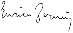

<table class="infobox biography vcard">
<tbody>
<tr>
<th colspan="2">

Enrico Fermi

</th>
</tr>
<tr>
<td colspan="2"></td>
</tr>
<tr>
<th scope="row">Born</th>
<td>29 September 1901 

<a title="Rome" href="https://en.wikipedia.org/wiki/Rome">Rome</a>,&nbsp;<a title="Kingdom of Italy" href="https://en.wikipedia.org/wiki/Kingdom_of_Italy">Kingdom of Italy</a>

</td>
</tr>
<tr>
<th scope="row">Died</th>
<td>28 November 1954&nbsp;(aged&nbsp;53) 

<a title="Chicago" href="https://en.wikipedia.org/wiki/Chicago">Chicago</a>,&nbsp;<a title="Illinois" href="https://en.wikipedia.org/wiki/Illinois">Illinois</a>, U.S.

</td>
</tr>
<tr>
<th scope="row">Citizenship</th>
<td class="category">Italian (1901&ndash;44) American (1944&ndash;54)</td>
</tr>
<tr>
<th scope="row">Alma&nbsp;mater</th>
<td><a title="Scuola Normale Superiore di Pisa" href="https://en.wikipedia.org/wiki/Scuola_Normale_Superiore_di_Pisa">Scuola Normale Superiore</a>&nbsp;of&nbsp;<a title="Pisa" href="https://en.wikipedia.org/wiki/Pisa">Pisa</a></td>
</tr>
<tr>
<th scope="row">Known&nbsp;for</th>
<td>

<ul>
<li>Demonstrating first self-sustaining&nbsp;<a title="Nuclear chain reaction" href="https://en.wikipedia.org/wiki/Nuclear_chain_reaction">nuclear chain reaction</a></li>
<li><a title="Fermi&ndash;Dirac statistics" href="https://en.wikipedia.org/wiki/Fermi%E2%80%93Dirac_statistics">Fermi&ndash;Dirac statistics</a></li>
<li><a title="Fermi's golden rule" href="https://en.wikipedia.org/wiki/Fermi%27s_golden_rule">Fermi's golden rule</a></li>
<li><a title="Fermi paradox" href="https://en.wikipedia.org/wiki/Fermi_paradox">Fermi paradox</a></li>
<li><a title="Fermi problem" href="https://en.wikipedia.org/wiki/Fermi_problem">Fermi method</a></li>
<li><a title="Fermi's interaction" href="https://en.wikipedia.org/wiki/Fermi%27s_interaction">Fermi theory of beta decay</a></li>
</ul>

</td>
</tr>
<tr>
<th scope="row">Spouse(s)</th>
<td><a class="mw-redirect" title="Laura Capon Fermi" href="https://en.wikipedia.org/wiki/Laura_Capon_Fermi">Laura Capon Fermi</a></td>
</tr>
<tr>
<th scope="row">Awards</th>
<td>

<ul>
<li><a title="Matteucci Medal" href="https://en.wikipedia.org/wiki/Matteucci_Medal">Matteucci Medal</a>&nbsp;(1926)</li>
<li><a class="mw-redirect" title="Nobel Prize for Physics" href="https://en.wikipedia.org/wiki/Nobel_Prize_for_Physics">Nobel Prize</a>&nbsp;(1938)</li>
<li><a title="Hughes Medal" href="https://en.wikipedia.org/wiki/Hughes_Medal">Hughes Medal</a>&nbsp;(1942)</li>
<li><a title="Medal for Merit" href="https://en.wikipedia.org/wiki/Medal_for_Merit">Medal for Merit</a>&nbsp;(1946)</li>
<li><a title="Franklin Medal" href="https://en.wikipedia.org/wiki/Franklin_Medal">Franklin Medal</a>&nbsp;(1947)</li>
<li><a title="Fellow of the Royal Society" href="https://en.wikipedia.org/wiki/Fellow_of_the_Royal_Society">ForMemRS</a>&nbsp;(1950)</li>
<li><a title="Barnard Medal for Meritorious Service to Science" href="https://en.wikipedia.org/wiki/Barnard_Medal_for_Meritorious_Service_to_Science">Barnard Medal for Meritorious Service to Science</a>&nbsp;(1950)</li>
<li><a title="Rumford Prize" href="https://en.wikipedia.org/wiki/Rumford_Prize">Rumford Prize</a>&nbsp;(1953)</li>
<li><a title="Max Planck Medal" href="https://en.wikipedia.org/wiki/Max_Planck_Medal">Max Planck Medal</a>&nbsp;(1954)</li>
</ul>

</td>
</tr>
<tr>
<td colspan="2"><strong>Scientific career</strong></td>
</tr>
<tr>
<th scope="row">Fields</th>
<td class="category"><a title="Physics" href="https://en.wikipedia.org/wiki/Physics">Physics</a></td>
</tr>
<tr>
<th scope="row">Institutions</th>
<td>

<ul>
<li><a title="Scuola Normale Superiore di Pisa" href="https://en.wikipedia.org/wiki/Scuola_Normale_Superiore_di_Pisa">Scuola Normale Superiore</a>&nbsp;of&nbsp;<a title="Pisa" href="https://en.wikipedia.org/wiki/Pisa">Pisa</a></li>
<li><a title="University of G&ouml;ttingen" href="https://en.wikipedia.org/wiki/University_of_G%C3%B6ttingen">University of G&ouml;ttingen</a></li>
<li><a title="Leiden University" href="https://en.wikipedia.org/wiki/Leiden_University">Leiden University</a></li>
<li><a title="University of Florence" href="https://en.wikipedia.org/wiki/University_of_Florence">University of Florence</a></li>
<li><a title="Sapienza University of Rome" href="https://en.wikipedia.org/wiki/Sapienza_University_of_Rome">Sapienza University of Rome</a></li>
<li><a title="Columbia University" href="https://en.wikipedia.org/wiki/Columbia_University">Columbia University</a></li>
<li><a title="University of Chicago" href="https://en.wikipedia.org/wiki/University_of_Chicago">University of Chicago</a></li>
</ul>

</td>
</tr>
<tr>
<th scope="row">Academic advisors</th>
<td>

<ul>
<li><a title="Luigi Puccianti" href="https://en.wikipedia.org/wiki/Luigi_Puccianti">Luigi Puccianti</a></li>
<li><a title="Max Born" href="https://en.wikipedia.org/wiki/Max_Born">Max Born</a></li>
<li><a title="Paul Ehrenfest" href="https://en.wikipedia.org/wiki/Paul_Ehrenfest">Paul Ehrenfest</a></li>
</ul>

</td>
</tr>
<tr>
<th scope="row">Doctoral students</th>
<td>

<ul>
<li><a title="Harold Agnew" href="https://en.wikipedia.org/wiki/Harold_Agnew">Harold Agnew</a></li>
<li><a title="Edoardo Amaldi" href="https://en.wikipedia.org/wiki/Edoardo_Amaldi">Edoardo Amaldi</a></li>
<li><a title="Owen Chamberlain" href="https://en.wikipedia.org/wiki/Owen_Chamberlain">Owen Chamberlain</a></li>
<li><a title="Geoffrey Chew" href="https://en.wikipedia.org/wiki/Geoffrey_Chew">Geoffrey Chew</a></li>
<li><a title="Mildred Dresselhaus" href="https://en.wikipedia.org/wiki/Mildred_Dresselhaus">Mildred Dresselhaus</a></li>
<li><a title="Jerome Isaac Friedman" href="https://en.wikipedia.org/wiki/Jerome_Isaac_Friedman">Jerome Friedman</a></li>
<li><a title="Richard Garwin" href="https://en.wikipedia.org/wiki/Richard_Garwin">Richard Garwin</a></li>
<li><a class="mw-redirect" title="Marvin Goldberger" href="https://en.wikipedia.org/wiki/Marvin_Goldberger">Marvin Goldberger</a></li>
<li><a title="Tsung-Dao Lee" href="https://en.wikipedia.org/wiki/Tsung-Dao_Lee">Tsung-Dao Lee</a></li>
<li><a title="Ettore Majorana" href="https://en.wikipedia.org/wiki/Ettore_Majorana">Ettore Majorana</a></li>
<li><a class="mw-redirect" title="Arthur Rosenfeld" href="https://en.wikipedia.org/wiki/Arthur_Rosenfeld">Arthur Rosenfeld</a></li>
<li><a title="Emilio Segr&egrave;" href="https://en.wikipedia.org/wiki/Emilio_Segr%C3%A8">Emilio Segr&egrave;</a></li>
<li><a title="Sam Treiman" href="https://en.wikipedia.org/wiki/Sam_Treiman">Sam Treiman</a></li>
</ul>

</td>
</tr>
<tr>
<th scope="row">Other&nbsp;notable students</th>
<td>

<ul>
<li><a title="Jack Steinberger" href="https://en.wikipedia.org/wiki/Jack_Steinberger">Jack Steinberger</a></li>
<li><a class="mw-redirect" title="Chen Ning Yang" href="https://en.wikipedia.org/wiki/Chen_Ning_Yang">Chen Ning Yang</a></li>
</ul>

</td>
</tr>
<tr>
<th colspan="2">Signature</th>
</tr>
<tr>
<td colspan="2"></td>
</tr>
</tbody>
</table>
 

<strong>Enrico Fermi</strong>&nbsp;(29 September 1901 - 28 November 1954) was an Italian (later&nbsp;<a class="mw-redirect" title="Naturalized" href="https://en.wikipedia.org/wiki/Naturalized">naturalized</a>&nbsp;American) physicist and the creator of the world's first&nbsp;<a title="Nuclear reactor" href="https://en.wikipedia.org/wiki/Nuclear_reactor">nuclear reactor</a>, the&nbsp;<a title="Chicago Pile-1" href="https://en.wikipedia.org/wiki/Chicago_Pile-1">Chicago Pile-1</a>. He has been called the "architect of the&nbsp;<a title="Atomic Age" href="https://en.wikipedia.org/wiki/Atomic_Age">nuclear age</a>"&nbsp;and the "architect of the atomic bomb".&nbsp;He was one of very few physicists to excel in both&nbsp;<a title="Theoretical physics" href="https://en.wikipedia.org/wiki/Theoretical_physics">theoretical physics</a>&nbsp;and&nbsp;<a title="Experimental physics" href="https://en.wikipedia.org/wiki/Experimental_physics">experimental physics</a>. Fermi was awarded the 1938&nbsp;<a title="Nobel Prize in Physics" href="https://en.wikipedia.org/wiki/Nobel_Prize_in_Physics">Nobel Prize in Physics</a>&nbsp;for his work on&nbsp;<a title="Induced radioactivity" href="https://en.wikipedia.org/wiki/Induced_radioactivity">induced radioactivity</a>&nbsp;by neutron bombardment and for the discovery of&nbsp;<a class="mw-redirect" title="Transuranium elements" href="https://en.wikipedia.org/wiki/Transuranium_elements">transuranium elements</a>. With his colleagues, Fermi filed several patents related to the use of nuclear power, all of which were taken over by the US government. He made significant contributions to the development of&nbsp;<a title="Statistical mechanics" href="https://en.wikipedia.org/wiki/Statistical_mechanics">statistical mechanics</a>,&nbsp;<a title="Quantum mechanics" href="https://en.wikipedia.org/wiki/Quantum_mechanics">quantum theory</a>, and&nbsp;<a title="Nuclear physics" href="https://en.wikipedia.org/wiki/Nuclear_physics">nuclear</a>&nbsp;and&nbsp;<a title="Particle physics" href="https://en.wikipedia.org/wiki/Particle_physics">particle physics</a>.

Fermi's first major contribution involved the field of&nbsp;<a title="Statistical mechanics" href="https://en.wikipedia.org/wiki/Statistical_mechanics">statistical mechanics</a>. After&nbsp;<a title="Wolfgang Pauli" href="https://en.wikipedia.org/wiki/Wolfgang_Pauli">Wolfgang Pauli</a>&nbsp;formulated his&nbsp;<a title="Pauli exclusion principle" href="https://en.wikipedia.org/wiki/Pauli_exclusion_principle">exclusion principle</a>&nbsp;in 1925, Fermi followed with a paper in which he applied the principle to an&nbsp;<a title="Ideal gas" href="https://en.wikipedia.org/wiki/Ideal_gas">ideal gas</a>, employing a statistical formulation now known as&nbsp;<a title="Fermi&ndash;Dirac statistics" href="https://en.wikipedia.org/wiki/Fermi%E2%80%93Dirac_statistics">Fermi&ndash;Dirac statistics</a>. Today, particles that obey the exclusion principle are called "<a title="Fermion" href="https://en.wikipedia.org/wiki/Fermion">fermions</a>". Pauli later postulated the existence of an uncharged invisible particle emitted along with an&nbsp;<a title="Electron" href="https://en.wikipedia.org/wiki/Electron">electron</a>&nbsp;during&nbsp;<a title="Beta decay" href="https://en.wikipedia.org/wiki/Beta_decay">beta decay</a>, to satisfy the law of&nbsp;<a title="Conservation of energy" href="https://en.wikipedia.org/wiki/Conservation_of_energy">conservation of energy</a>. Fermi took up this idea, developing a model that incorporated the postulated particle, which he named the "<a title="Neutrino" href="https://en.wikipedia.org/wiki/Neutrino">neutrino</a>". His theory, later referred to as&nbsp;<a title="Fermi's interaction" href="https://en.wikipedia.org/wiki/Fermi%27s_interaction">Fermi's interaction</a>&nbsp;and now called&nbsp;<a title="Weak interaction" href="https://en.wikipedia.org/wiki/Weak_interaction">weak interaction</a>, described one of the four&nbsp;<a title="Fundamental interaction" href="https://en.wikipedia.org/wiki/Fundamental_interaction">fundamental interactions</a>&nbsp;in nature. Through experiments inducing radioactivity with the recently discovered&nbsp;<a title="Neutron" href="https://en.wikipedia.org/wiki/Neutron">neutron</a>, Fermi discovered that&nbsp;<a class="mw-redirect" title="Slow neutron" href="https://en.wikipedia.org/wiki/Slow_neutron">slow neutrons</a>&nbsp;were more easily&nbsp;<a title="Neutron capture" href="https://en.wikipedia.org/wiki/Neutron_capture">captured</a>&nbsp;by&nbsp;<a title="Atomic nucleus" href="https://en.wikipedia.org/wiki/Atomic_nucleus">atomic nuclei</a>&nbsp;than fast ones, and he developed the&nbsp;<a class="mw-redirect" title="Fermi age equation" href="https://en.wikipedia.org/wiki/Fermi_age_equation">Fermi age equation</a>&nbsp;to describe this. After bombarding&nbsp;<a title="Thorium" href="https://en.wikipedia.org/wiki/Thorium">thorium</a>&nbsp;and&nbsp;<a title="Uranium" href="https://en.wikipedia.org/wiki/Uranium">uranium</a>&nbsp;with slow neutrons, he concluded that he had created new elements. Although he was awarded the Nobel Prize for this discovery, the new elements were later revealed to be&nbsp;<a title="Nuclear fission product" href="https://en.wikipedia.org/wiki/Nuclear_fission_product">nuclear fission products</a>.

Fermi left Italy in 1938 to escape new&nbsp;<a title="Italian racial laws" href="https://en.wikipedia.org/wiki/Italian_racial_laws">Italian racial laws</a>&nbsp;that affected his Jewish wife,&nbsp;<a class="mw-redirect" title="Laura Capon" href="https://en.wikipedia.org/wiki/Laura_Capon">Laura Capon</a>. He emigrated to the United States, where he worked on the&nbsp;<a title="Manhattan Project" href="https://en.wikipedia.org/wiki/Manhattan_Project">Manhattan Project</a>&nbsp;during World War II. Fermi led the team that designed and built Chicago Pile-1, which went&nbsp;<a title="Nuclear reactor physics" href="https://en.wikipedia.org/wiki/Nuclear_reactor_physics#Criticality">critical</a>&nbsp;on 2 December 1942, demonstrating the first human-created, self-sustaining&nbsp;<a title="Nuclear chain reaction" href="https://en.wikipedia.org/wiki/Nuclear_chain_reaction">nuclear chain reaction</a>. He was on hand when the&nbsp;<a title="X-10 Graphite Reactor" href="https://en.wikipedia.org/wiki/X-10_Graphite_Reactor">X-10 Graphite Reactor</a>&nbsp;at&nbsp;<a title="Oak Ridge, Tennessee" href="https://en.wikipedia.org/wiki/Oak_Ridge,_Tennessee">Oak Ridge, Tennessee</a>, went critical in 1943, and when the&nbsp;<a title="B Reactor" href="https://en.wikipedia.org/wiki/B_Reactor">B Reactor</a>&nbsp;at the&nbsp;<a title="Hanford Site" href="https://en.wikipedia.org/wiki/Hanford_Site">Hanford Site</a>&nbsp;did so the next year. At&nbsp;<a title="Project Y" href="https://en.wikipedia.org/wiki/Project_Y">Los Alamos</a>, he headed F Division, part of which worked on&nbsp;<a title="Edward Teller" href="https://en.wikipedia.org/wiki/Edward_Teller">Edward Teller</a>'s&nbsp;<a title="Thermonuclear fusion" href="https://en.wikipedia.org/wiki/Thermonuclear_fusion">thermonuclear</a>&nbsp;"<a title="History of the Teller&ndash;Ulam design" href="https://en.wikipedia.org/wiki/History_of_the_Teller%E2%80%93Ulam_design">Super</a>" bomb. He was present at the&nbsp;<a title="Trinity (nuclear test)" href="https://en.wikipedia.org/wiki/Trinity_(nuclear_test)">Trinity test</a>&nbsp;on 16 July 1945, where he used his&nbsp;<a title="Fermi problem" href="https://en.wikipedia.org/wiki/Fermi_problem">Fermi method</a>&nbsp;to estimate the bomb's yield.

After the war, Fermi served under&nbsp;<a title="J. Robert Oppenheimer" href="https://en.wikipedia.org/wiki/J._Robert_Oppenheimer">J. Robert Oppenheimer</a>&nbsp;on the General Advisory Committee, which advised the&nbsp;<a title="United States Atomic Energy Commission" href="https://en.wikipedia.org/wiki/United_States_Atomic_Energy_Commission">Atomic Energy Commission</a>&nbsp;on nuclear matters. After the detonation of the first Soviet&nbsp;<a class="mw-redirect" title="Fission bomb" href="https://en.wikipedia.org/wiki/Fission_bomb">fission bomb</a>&nbsp;in August 1949, he strongly opposed the development of a hydrogen bomb on both moral and technical grounds. He was among the scientists who testified on Oppenheimer's behalf at the 1954&nbsp;<a title="Oppenheimer security hearing" href="https://en.wikipedia.org/wiki/Oppenheimer_security_hearing">hearing</a>&nbsp;that resulted in the denial of Oppenheimer's security clearance. Fermi did important work in particle physics, especially related to&nbsp;<a title="Pion" href="https://en.wikipedia.org/wiki/Pion">pions</a>&nbsp;and&nbsp;<a title="Muon" href="https://en.wikipedia.org/wiki/Muon">muons</a>, and he speculated that&nbsp;<a title="Cosmic ray" href="https://en.wikipedia.org/wiki/Cosmic_ray">cosmic rays</a>&nbsp;arose when material was accelerated by magnetic fields in interstellar space. Many awards, concepts, and institutions are&nbsp;<a title="List of things named after Enrico Fermi" href="https://en.wikipedia.org/wiki/List_of_things_named_after_Enrico_Fermi">named after Fermi</a>, including the&nbsp;<a title="Enrico Fermi Award" href="https://en.wikipedia.org/wiki/Enrico_Fermi_Award">Enrico Fermi Award</a>, the&nbsp;<a title="Enrico Fermi Institute" href="https://en.wikipedia.org/wiki/Enrico_Fermi_Institute">Enrico Fermi Institute</a>, the&nbsp;<a title="Fermilab" href="https://en.wikipedia.org/wiki/Fermilab">Fermi National Accelerator Laboratory (Fermilab)</a>, the&nbsp;<a title="Fermi Gamma-ray Space Telescope" href="https://en.wikipedia.org/wiki/Fermi_Gamma-ray_Space_Telescope">Fermi Gamma-ray Space Telescope</a>, and the synthetic element&nbsp;<a title="Fermium" href="https://en.wikipedia.org/wiki/Fermium">fermium</a>, making him one of 16 scientists who have&nbsp;<a class="mw-redirect" title="List of scientists whose names are used in chemical element names" href="https://en.wikipedia.org/wiki/List_of_scientists_whose_names_are_used_in_chemical_element_names">elements named after them</a>. Fermi tutored or directly influenced no fewer than 8 young researchers who went on to win Nobel Prizes.

 

<strong> Publications: </strong>

<ul>

 <li><a target="_blank" href="https://github.com/manjunath5496/Enrico-Fermi-Papers/blob/master/tst(277).pdf" style="text-decoration:none;">Elementary Particles</a></li>
                            
 <li><a target="_blank" href="https://github.com/manjunath5496/Enrico-Fermi-Papers/blob/master/tst(273).pdf" style="text-decoration:none;">Artificial radioactivity produced by neutron bombardment [Nobel Lecture]</a></li>

<li><a target="_blank" href="https://github.com/manjunath5496/Enrico-Fermi-Papers/blob/master/tst(274).pdf" style="text-decoration:none;">Molecules, crystals, and quantum statistics</a></li>
 <li><a target="_blank" href="https://github.com/manjunath5496/Enrico-Fermi-Papers/blob/master/tst(275).pdf" style="text-decoration:none;">Nuclear Physics: A Course Given by Enrico Fermi at the University of Chicago</a></li>                              

 <li><a target="_blank" href="https://github.com/manjunath5496/Enrico-Fermi-Papers/blob/master/tst(276).pdf" style="text-decoration:none;">Thermodynamics</a></li>
                            

</ul>

 
